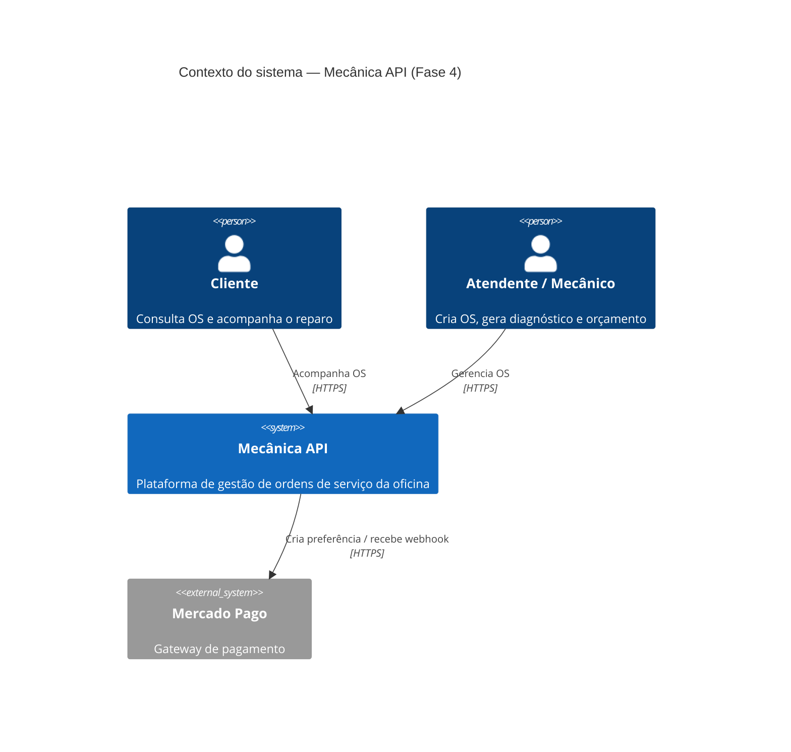
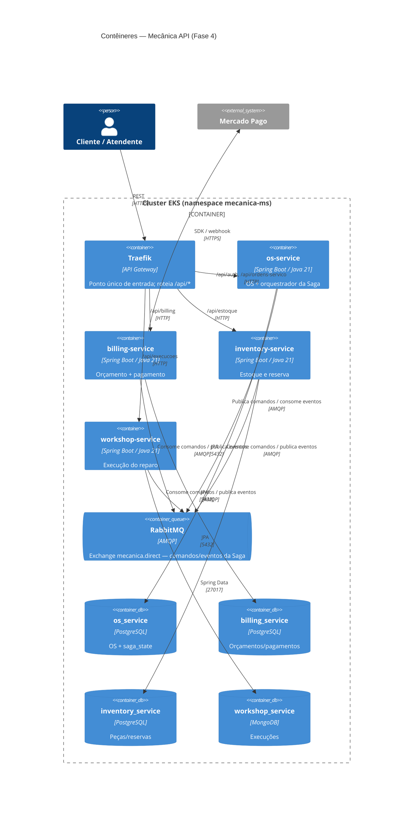
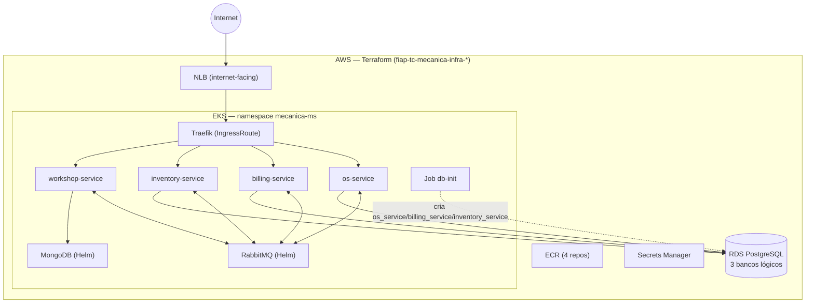

# ADR 0001 — Arquitetura de microsserviços (C4 + topologia)

- **Status:** Aceito
- **Data:** 2026-07
- **Contexto do desafio:** Fase 4 — refatorar a aplicação em, no mínimo, 3
  microsserviços independentes, cada um com seu próprio repositório,
  infraestrutura e banco de dados.

## Contexto

A Fase 3 entregou um monólito (`fiap-tc-mecanica-app`) hexagonal/DDD em torno da
Ordem de Serviço (OS) de uma oficina mecânica. A Fase 4 exige decomposição em
microsserviços independentes, aplicando o **Saga Pattern** para manter a
consistência de um fluxo de negócio que cruza vários serviços e bancos.

Bounded contexts identificados no domínio:

- **Ordem de Serviço** — ciclo de vida da OS e orquestração do fluxo.
- **Faturamento** — orçamento e pagamento (Mercado Pago).
- **Estoque** — reserva e estorno de peças.
- **Execução (oficina)** — registro físico do reparo.

## Decisão

Decompor em **4 microsserviços**, um por bounded context, cada um em seu próprio
repositório, com CI/CD, infraestrutura e banco próprios:

| Serviço | Repositório | Responsabilidade | Banco |
|---------|-------------|------------------|-------|
| os-service | `mecanica-os-service` | Ciclo de vida da OS + **orquestrador da Saga** | PostgreSQL |
| billing-service | `mecanica-billing-service` | Orçamento + pagamento (Mercado Pago) | PostgreSQL |
| inventory-service | `mecanica-inventory-service` | Estoque, reserva e estorno de peças | PostgreSQL |
| workshop-service | `mecanica-workshop-service` | Execução física do reparo | MongoDB |

Componentes de apoio:

- **`mecanica-shared-kernel`** — Value Objects genéricos (CPF, CNPJ, Email,
  Endereco, PlacaVeiculo, TelefoneBr) publicados no GitHub Packages. Compartilha
  *tipos*, não estado nem banco — não cria acoplamento de runtime.
- **`fiap-tc-mecanica-lambda`** — autenticação CPF → JWT (AWS Lambda), reusada da
  Fase 3.

**Estilo interno:** cada serviço mantém Arquitetura Hexagonal + DDD (domínio
isolado de infraestrutura via ports/adapters).

**Comunicação:**
- **Síncrona (externa):** REST via **Traefik** como API Gateway (ponto único de
  entrada), roteando por `PathPrefix` para cada serviço.
- **Assíncrona (interna):** **RabbitMQ** para a Saga (comandos e eventos) — ver
  [ADR 0002](0002-saga-orquestrada-rabbitmq.md).

### C4 — Nível 1: Contexto

### C4 — Nível 2: Contêineres

### Topologia de implantação (AWS / EKS)

## Consequências

**Positivas**
- Deploy, escala e evolução independentes por serviço (repos + CI/CD próprios).
- Isolamento de falhas e de dados (database-per-service).
- Fronteiras de domínio explícitas; times podem trabalhar em paralelo.

**Negativas / custos**
- Complexidade operacional maior (rede, mensageria, observabilidade distribuída).
- Consistência **eventual** — sem transação ACID cruzando serviços; exige Saga e
  compensações ([ADR 0002](0002-saga-orquestrada-rabbitmq.md)).
- Depuração distribuída exige correlação de logs/traces.

## Alternativas consideradas

- **Manter o monólito modular** — rejeitado: não atende ao requisito de
  microsserviços independentes com repositório/infra/banco próprios.
- **Apenas 3 serviços** (juntar workshop ao os) — rejeitado: workshop tem modelo
  de dados e ciclo próprios (execução física), e a separação evidencia melhor a
  Saga e a persistência poliglota.
