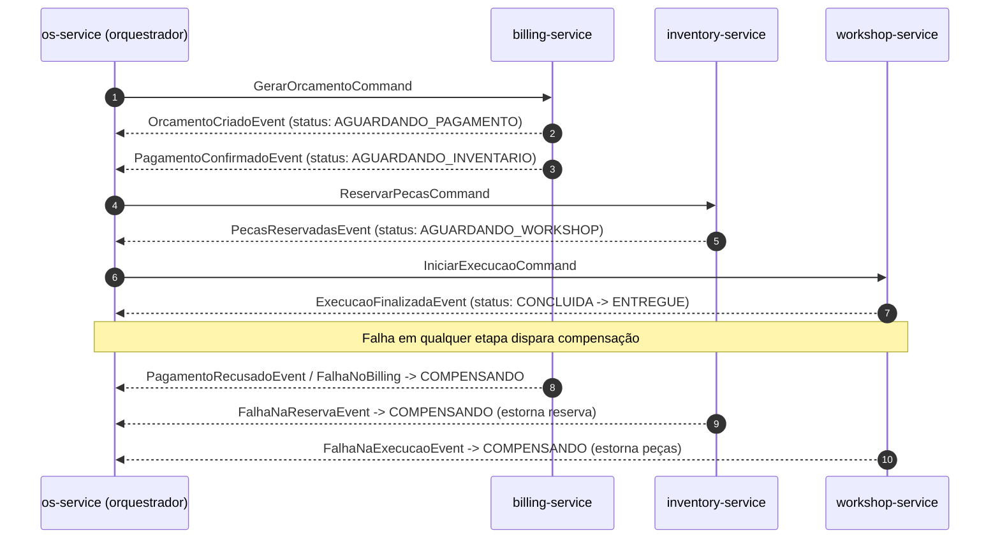

# ADR 0002 — Coordenação da transação distribuída: Saga orquestrada via RabbitMQ

- **Status:** Aceito
- **Data:** 2026-07
- **Relacionado:** [ADR 0001](0001-arquitetura-microsservicos-c4.md)

## Contexto

O fluxo de negócio "processar uma OS" cruza os quatro serviços e seus bancos:
gerar orçamento (billing) → pagamento (billing/Mercado Pago) → reservar peças
(inventory) → executar reparo (workshop). Com **database-per-service** não existe
transação ACID distribuída; é preciso um mecanismo de **consistência eventual**
com **compensação** em caso de falha em qualquer etapa.

## Decisão

Adotar o **Saga Pattern na variante orquestrada (orchestration)**, com o
**os-service como orquestrador**.

- Classe central `OsSagaCoordinator` conduz o fluxo e decide o próximo passo.
- O estado da saga é **persistido** (`saga_state`) — a saga é retomável e
  auditável, não depende de estado em memória.
- Mensageria: **RabbitMQ**, exchange **direct `mecanica.direct`**.
  - **Comandos** (orquestrador → serviço): `mecanica.billing.gerar-orcamento`,
    `mecanica.inventory.reservar-pecas`, `mecanica.workshop.iniciar-execucao`.
  - **Eventos** (serviço → orquestrador): `mecanica.os.orcamento-criado`,
    `...pagamento-confirmado`, `...pagamento-recusado`, `...pecas-reservadas`,
    `...falha-reserva`, `...execucao-finalizada`, `...falha-execucao`,
    `...falha-no-billing`.
- Idempotência no consumo (ex.: coleção `processed_commands` no workshop) para
  tolerar reentrega do broker.

### Fluxo feliz e compensação

Estados da saga: `AGUARDANDO_PAGAMENTO` → `AGUARDANDO_INVENTARIO` →
`AGUARDANDO_WORKSHOP` → `CONCLUIDA`; ramo de falha:
`COMPENSANDO` → `COMPENSADA_BILLING` / `COMPENSADA` / `COMPENSADA_WORKSHOP`,
levando a OS a **CANCELADA**.

## Justificativa (orquestração vs. alternativas)

- **Orquestração (escolhida):** lógica do fluxo centralizada e explícita no
  os-service; fácil de entender, testar e observar; estado persistido permite
  retomada e diagnóstico. Custo: o orquestrador conhece os passos (acoplamento
  lógico controlado).
- **Coreografia:** cada serviço reage a eventos sem coordenador central. Menor
  acoplamento, porém o fluxo fica "espalhado" e difícil de auditar/depurar —
  pior para um domínio com passos e compensações bem definidos.
- **2PC / XA (commit em duas fases):** rejeitado — bloqueante, baixa
  disponibilidade e sem suporte real entre PostgreSQL + MongoDB + serviços HTTP.

## Consequências

**Positivas**
- Fluxo e compensações explícitos e centralizados; saga auditável e retomável.
- Desacoplamento temporal entre serviços (assíncrono, tolerante a indisponibilidade).

**Negativas**
- Consistência eventual (janelas de estado intermediário observáveis).
- Necessidade de idempotência e tratamento de reentrega/mensagens fora de ordem.
- O orquestrador é um ponto de coordenação — mitigado por estado persistido e
  serviço stateless/replicável.
